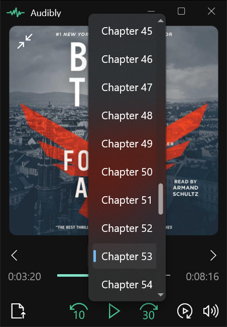
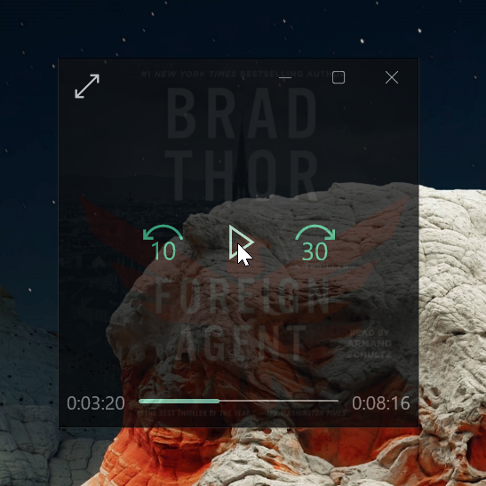

<a name="readme-top"></a>


[![Contributors][contributors-shield]][contributors-url]
[![Forks][forks-shield]][forks-url]
[![Stargazers][stars-shield]][stars-url]
[![Issues][issues-shield]][issues-url]
[![MIT License][license-shield]][license-url]
[![LinkedIn][linkedin-shield]][linkedin-url]


<!-- PROJECT LOGO -->
<br />
<div align="center">
  <a href="https://github.com/rstewa35/Audibly">
    
  </a>

<h3 align="center">Audibly</h3>

  <p align="center">
    Desktop Audiobook player for Windows 10/11. I created this because Audible removed their desktop player.
    <br />
    <a href="https://github.com/rstewa35/Audibly"><strong>Explore the docs »</strong></a>
    <br />
    <br />
    <a href="https://github.com/rstewa35/Audibly">View Demo</a>
    ·
    <a href="https://github.com/rstewa35/Audibly/issues">Report Bug</a>
    ·
    <a href="https://github.com/rstewa35/Audibly/issues">Request Feature</a>
  </p>
</div>


<!-- TABLE OF CONTENTS -->
<details>
  <summary>Table of Contents</summary>
  <ol>
    <li>
      <a href="#about-the-project">About The Project</a>
      <ul>
        <li><a href="#built-with">Built With</a></li>
      </ul>
    </li>
    <li>
      <a href="#getting-started">Getting Started</a>
      <ul>
        <li><a href="#prerequisites">Prerequisites</a></li>
        <li><a href="#installation">Installation</a></li>
      </ul>
    </li>
    <li><a href="#usage">Usage</a></li>
    <li><a href="#roadmap">Roadmap</a></li>
    <li><a href="#contributing">Contributing</a></li>
    <li><a href="#license">License</a></li>
    <li><a href="#contact">Contact</a></li>
    <li><a href="#acknowledgments">Acknowledgments</a></li>
  </ol>
</details>


<!-- ABOUT THE PROJECT -->
## About The Project

### Screenshots

#### Default View

<p align="middle">
  
  
  
</p> 

#### Compact View

<p align="middle">
  
  
</p> 

<p align="right">(<a href="#readme-top">back to top</a>)</p>


### Built With

[![WinUI 3][winui]][winui-url]

<p align="right">(<a href="#readme-top">back to top</a>)</p>


<!-- GETTING STARTED -->
## Getting Started

TODO

### Prerequisites

TODO

### Installation

1. Clone the repo
   ```sh
   git clone https://github.com/rstewa35/Audibly.git
   ```
2. TODO

<p align="right">(<a href="#readme-top">back to top</a>)</p>


<!-- USAGE EXAMPLES -->
## Usage

Use this space to show useful examples of how a project can be used. Additional screenshots, code examples and demos work well in this space. You may also link to more resources.

_For more examples, please refer to the [Documentation](https://example.com)_

<p align="right">(<a href="#readme-top">back to top</a>)</p>


<!-- ROADMAP -->
## Roadmap

- [ ] Feature 1
- [ ] Feature 2
- [ ] Feature 3
    - [ ] Nested Feature

See the [open issues](https://github.com/rstewa35/Audibly/issues) for a full list of proposed features (and known issues).

<p align="right">(<a href="#readme-top">back to top</a>)</p>


<!-- CONTRIBUTING -->
## Contributing

Contributions are what make the open source community such an amazing place to learn, inspire, and create. Any contributions you make are **greatly appreciated**.

If you have a suggestion that would make this better, please fork the repo and create a pull request. You can also simply open an issue with the tag "enhancement".
Don't forget to give the project a star! Thanks again!

1. Fork the Project
2. Create your Feature Branch (`git checkout -b feature/AmazingFeature`)
3. Commit your Changes (`git commit -m 'Add some AmazingFeature'`)
4. Push to the Branch (`git push origin feature/AmazingFeature`)
5. Open a Pull Request

<p align="right">(<a href="#readme-top">back to top</a>)</p>


<!-- LICENSE -->
## License

Distributed under the MIT License. See `LICENSE.txt` for more information.

<p align="right">(<a href="#readme-top">back to top</a>)</p>


<!-- CONTACT -->
## Contact

Project Link: [https://github.com/rstewa35/Audibly](https://github.com/rstewa35/Audibly)

<p align="right">(<a href="#readme-top">back to top</a>)</p>


<!-- MARKDOWN LINKS & IMAGES -->
<!-- https://www.markdownguide.org/basic-syntax/#reference-style-links -->
[contributors-shield]: https://img.shields.io/github/contributors/rstewa35/Audibly.svg?style=for-the-badge
[contributors-url]: https://github.com/rstewa35/Audibly/graphs/contributors
[forks-shield]: https://img.shields.io/github/forks/rstewa35/Audibly.svg?style=for-the-badge
[forks-url]: https://github.com/rstewa35/Audibly/network/members
[stars-shield]: https://img.shields.io/github/stars/rstewa35/Audibly.svg?style=for-the-badge
[stars-url]: https://github.com/rstewa35/Audibly/stargazers
[issues-shield]: https://img.shields.io/github/issues/rstewa35/Audibly.svg?style=for-the-badge
[issues-url]: https://github.com/rstewa35/Audibly/issues
[license-shield]: https://img.shields.io/github/license/rstewa35/Audibly.svg?style=for-the-badge
[license-url]: https://github.com/rstewa35/Audibly/blob/master/LICENSE.txt
[linkedin-shield]: https://img.shields.io/badge/-LinkedIn-black.svg?style=for-the-badge&logo=linkedin&colorB=555
[linkedin-url]: https://linkedin.com/in/linkedin_username
[product-screenshot]: images/default_screenshot.png
[winui]: https://img.shields.io/badge/-WinUI_3-512BD4?style=for-the-badge&logo=.net&logoColor=white
[winui-url]: https://learn.microsoft.com/en-us/windows/apps/winui