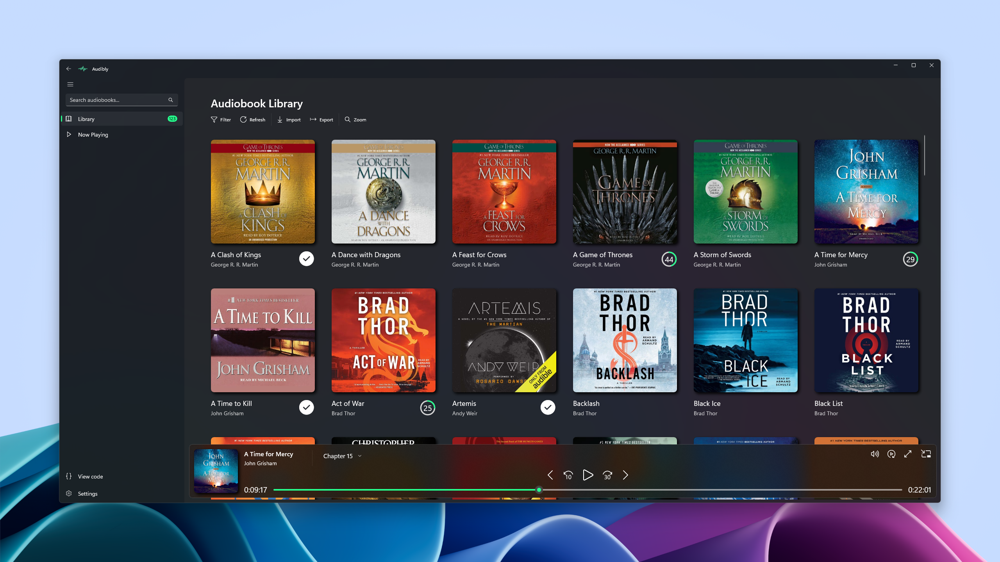
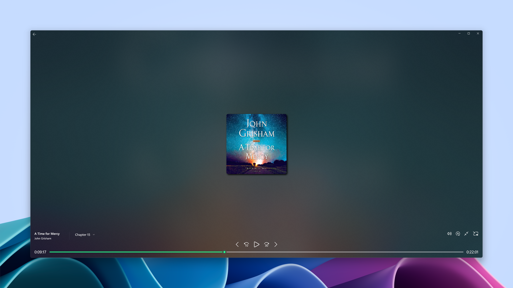
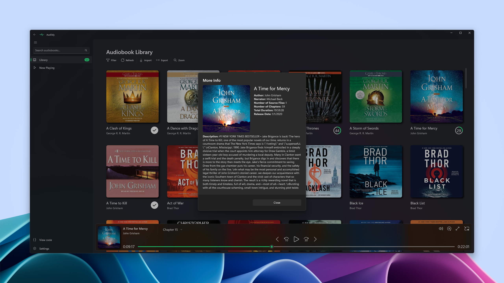

<!-- PROJECT SHIELDS -->
[![Version][version-shield]][version-url]
[![Contributors][contributors-shield]][contributors-url]
[![Forks][forks-shield]][forks-url]
[![Stargazers][stars-shield]][stars-url]
[![Issues][issues-shield]][issues-url]
[![MIT License][license-shield]][license-url]
[![LinkedIn][linkedin-shield]][linkedin-url]

<!-- PROJECT LOGO -->
 

  

<h3 align="center">Audibly — Audiobook Player</h3>

  

    Desktop Audiobook player for Windows 10/11. Supports `.m4b` and `.mp3` file types. It also supports audiobooks that
    consist of multiple files. I created this because Audible removed their desktop player (and I really hate browser based players).
     
    <a href="https://github.com/rstewa/Audibly"><strong>Explore the docs »</strong></a>
     
     
    <a href="https://github.com/rstewa/Audibly">View Demo</a>
    ·
    <a href="https://github.com/rstewa/Audibly/issues/new?labels=bug&template=bug-report---.md">Report Bug</a>
    ·
    <a href="https://github.com/rstewa/Audibly/issues/new?labels=enhancement&template=feature-request---.md">Request Feature</a>
  

<!-- link to store page -->

 
 

<!-- TABLE OF CONTENTS -->

  
Table of Contents

  <ol>
    <li>
      <a href="#about-the-project">About The Project</a>
      <ul>
        <li><a href="#built-with">Built With</a></li>
      </ul>
    </li>
    <li>
      <a href="#getting-started">Getting Started</a>
      <ul>
        <li><a href="#prerequisites">Prerequisites</a></li>
        <li><a href="#installation">Installation</a></li>
      </ul>
    </li>
    <li><a href="#usage">Usage</a></li>
    <li><a href="#roadmap">Roadmap</a></li>
    <li><a href="#contributing">Contributing</a></li>
    <li><a href="#license">License</a></li>
    <li><a href="#contact">Contact</a></li>
    <li><a href="#acknowledgments">Acknowledgments</a></li>
  </ol>

<!-- ABOUT THE PROJECT -->
## About The Project

This desktop audiobook player for Windows 10/11 supports playing .m4b and .mp3 files, including audiobooks composed of multiple files.

(<a href="#readme-top">back to top</a>)

## Screenshots

### Home/Library

  

 

### Expanded Player

  

 

### Mini-player

  

 

### More Info Dialog

  

 

(<a href="#readme-top">back to top</a>)

### Built With

[![WinUI 3][winui]][winui-url]

(<a href="#readme-top">back to top</a>)

<!-- TODO: GETTING STARTED -->

<!-- TODO: USAGE EXAMPLES -->

<!-- ROADMAP -->
## Roadmap

- [x] Add `.mp3` file support
- [x] Add support for multiple files in an audiobook
- [x] Add mini-player

See the [open issues](https://github.com/rstewa/Audibly/issues) for a full list of proposed features (and known issues).

(<a href="#readme-top">back to top</a>)

<!-- CONTRIBUTING -->
## Contributing

Contributions are what make the open source community such an amazing place to learn, inspire, and create. Any contributions you make are **greatly appreciated**.

If you have a suggestion that would make this better, please fork the repo and create a pull request. You can also simply open an issue with the tag "enhancement".
Don't forget to give the project a star! Thanks again!

1. Fork the Project
2. Create your Feature Branch (`git checkout -b feature/AmazingFeature`)
3. Commit your Changes (`git commit -m 'Add some AmazingFeature'`)
4. Push to the Branch (`git push origin feature/AmazingFeature`)
5. Open a Pull Request

### Top contributors:

(<a href="#readme-top">back to top</a>)

<!-- LICENSE -->
## License

Distributed under the GNU General Public License v3.0. See `LICENSE.txt` for more information.

(<a href="#readme-top">back to top</a>)

<!-- CONTACT -->
## Contact

rstewa - dev@audibly.info

Project Link: [https://github.com/rstewa/Audibly](https://github.com/rstewa/Audibly)

(<a href="#readme-top">back to top</a>)

<!-- ACKNOWLEDGMENTS -->
## Acknowledgments

* [Rise Media Player](https://github.com/Rise-Software/Rise-Media-Player) for inspiration
* [Libation](https://github.com/rmcrackan/Libation) for the FolderIcon code
* [OpenAudible](https://openaudible.org/) for giving me a license and for helping me find/fix a bug in my import code
* [Best-README-Template](https://github.com/othneildrew/Best-README-Template) for the README template

(<a href="#readme-top">back to top</a>)

<!-- MARKDOWN LINKS & IMAGES -->
<!-- https://www.markdownguide.org/basic-syntax/#reference-style-links -->
[version-shield]: https://img.shields.io/github/v/release/rstewa/audibly?style=for-the-badge
[version-url]: https://github.com/rstewa/audibly/releases/latest
[contributors-shield]: https://img.shields.io/github/contributors/rstewa/Audibly.svg?style=for-the-badge
[contributors-url]: https://github.com/rstewa/Audibly/graphs/contributors
[forks-shield]: https://img.shields.io/github/forks/rstewa/Audibly.svg?style=for-the-badge
[forks-url]: https://github.com/rstewa/Audibly/network/members
[stars-shield]: https://img.shields.io/github/stars/rstewa/Audibly.svg?style=for-the-badge
[stars-url]: https://github.com/rstewa/Audibly/stargazers
[issues-shield]: https://img.shields.io/github/issues/rstewa/Audibly.svg?style=for-the-badge
[issues-url]: https://github.com/rstewa/Audibly/issues
[license-shield]: https://img.shields.io/github/license/rstewa/Audibly.svg?style=for-the-badge
[license-url]: https://github.com/rstewa/Audibly/blob/master/LICENSE.txt
[linkedin-shield]: https://img.shields.io/badge/-LinkedIn-black.svg?style=for-the-badge&logo=linkedin&colorB=555
[linkedin-url]: https://www.linkedin.com/in/stewart-ryan-p/
[winui]: https://img.shields.io/badge/-WinUI_3-512BD4?style=for-the-badge&logo=.net&logoColor=white
[winui-url]: https://learn.microsoft.com/en-us/windows/apps/winui
